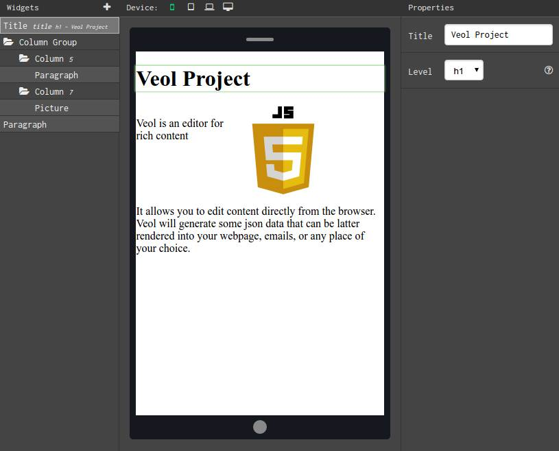

Veol
====

Veol is a customisable content editor for javascript. It gives the ability to build webpage, emails, and other content with an - easy to use - GUI and those directly from the browser.



Getting Started
---------------

### Dependency

Veol depends on ``jquery`` (jquery slim accepted) and ``font awesome`` for icons. Additionally you can install the font ``inconsolata`` in order to have a more beautiful monospace font.


### Installing

You can install veol with bower: ``bower install --save veol`` or you can get a copy of this repository and use the files ``veol.min.js`` and ``veol.min.css`` from the directory ``dist``.

Here is a bootstrap html file:

```html
<html>
    
    <head>  
        <link href="path-to/font-awesome.css" rel="stylesheet">
        <link rel="stylesheet" href="veol.min.css"/>
        <!-- Optionally install inconsolata -->
        <link href="https://fonts.googleapis.com/css?family=Inconsolata" rel="stylesheet">
    </head>
    
    <body>
    
        <script src="../bower_components/jquery/dist/jquery.slim.js"></script>
        <script src="../dist/veol.js"></script>
        
        <script>
            $(function(){
                // TODO
                // Here goes your code (see documentation for more details) 
            });
        </script>
        
    </body>
</html>
```

Documentation
-------------

TODO


Develop and contribute
----------------------

All sources are in the ``src`` directory, javascript is written with ES6 and compiled with webpack, and css is written with sass.
 
### Setup your dev environment

To setup the dev environment you have to install npm and bower dependencies:

```sh
    npm install
    bower install
```

### Compile the sources

The **dev** command will build the project once and watch for changes.

```sh
    npm run dev
```

The **build** command will build the project for deployment, including minifications.

```sh
    npm run build
```

### Run tests

```sh
    npm test
```

### Check it visually

If you want to see and test the application, you can open open the file ``tests/simple-test.html``. 


Authors
-------

* **Soufiane Ghzal** - *Initial work* - [gsouf](https://github.com/gsouf)

See also the list of [contributors](https://github.com/gsouf/veol.js/contributors) who participated in this project.

License
-------

This project is licensed under the terms of the [Fair License](https://opensource.org/licenses/Fair).


Roadmap
-------

- Translation tools
- Doc and guides
- make the application to accept toolbox (make a single call to have a full application running)
- json schema generation from pageMaker config
